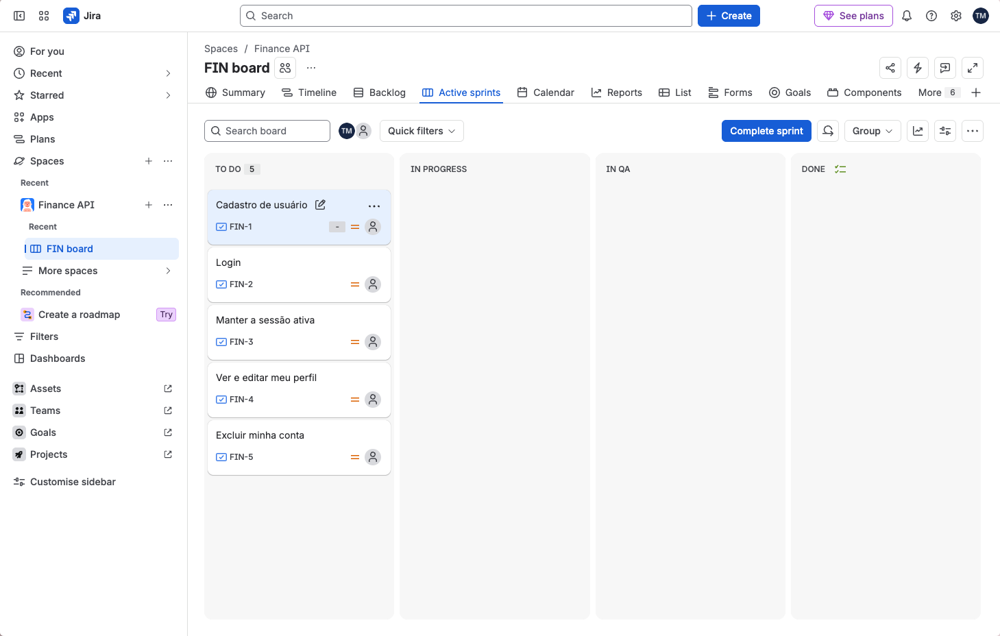
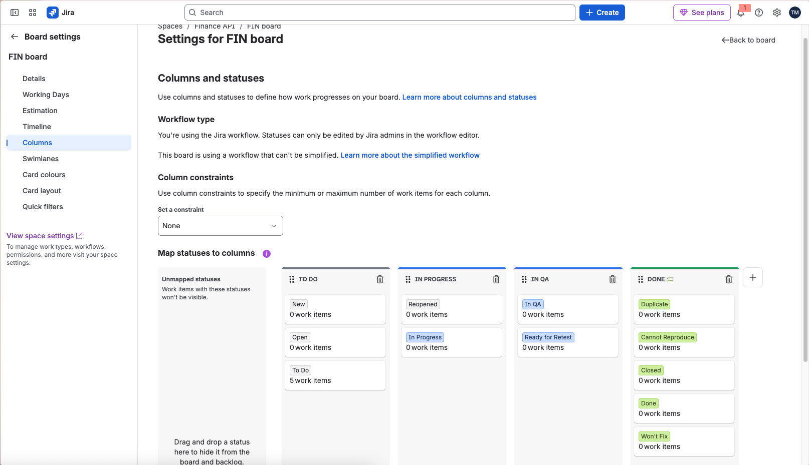
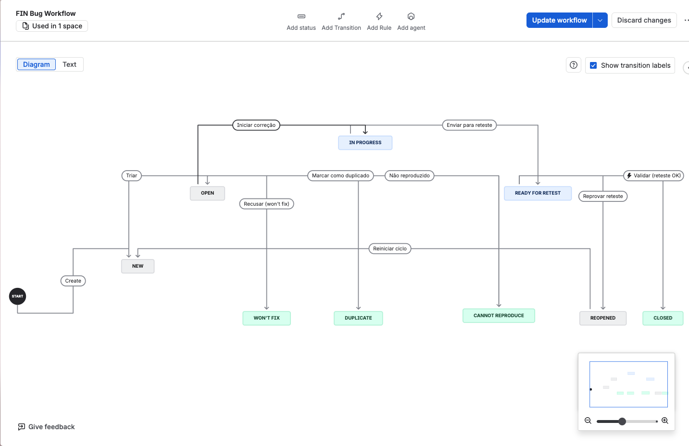
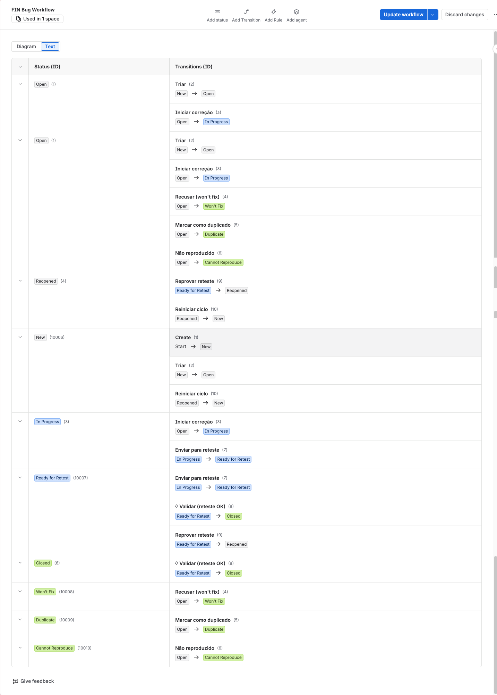
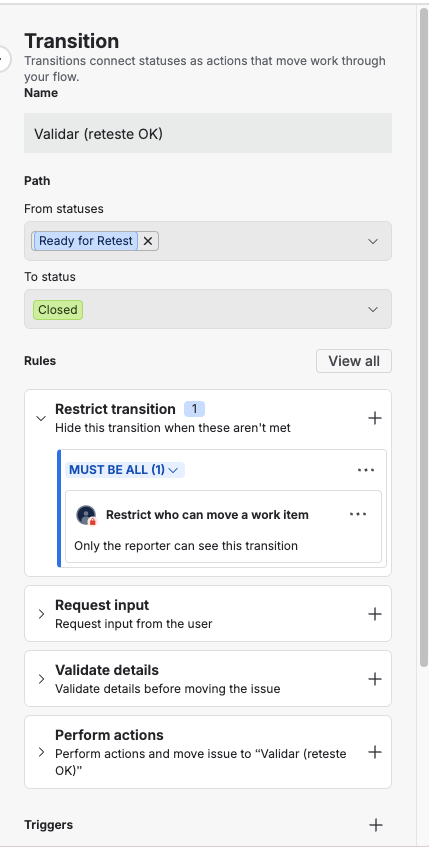
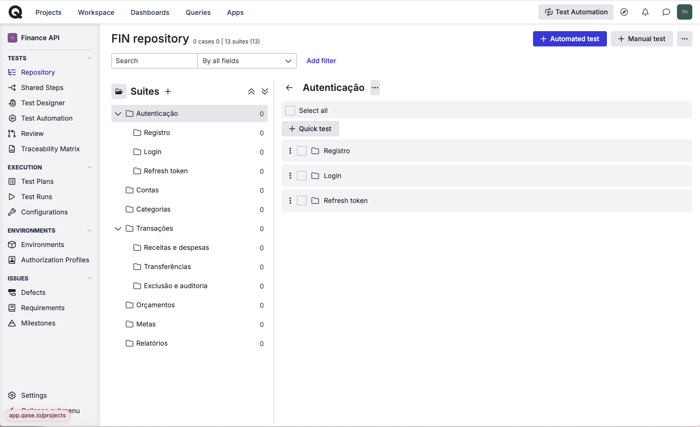

# Módulo 03 — Jira e Qase

## Board

## Workflow do bug

## Árvore de suítes (Qase)

## O que foi mais difícil de configurar

A parte mais difícil foi montar o workflow via API reaproveitando status que já existiam na instância. No Jira, os status são globais, então não é possível criar um novo status com o mesmo nome de um já existente, como In Review ou Ready for Retest. Só entendi isso depois de receber um erro 400 indicando nome duplicado ao tentar criar o workflow. Para resolver, precisei consultar o endpoint /rest/api/3/statuses/search, identificar o ID de cada status existente e referenciá-lo no payload do workflow, em vez de declarar o status como novo. Só assim consegui associar os status corretamente às transições.
